# Lokaverkefni
---
#### Það var vandamál með að setja upp CentOS client2. Ég reyndi að laga það en náði því ekki. Abdel sagði mér að nota bara 2 Ubuntu client-a. Setti bara skjáskot af client1 því skjáskotin eru þau sömu á báðum vélum og ég komst ekki nógu langt til þess að setja upp Postfix og fleirra þar sem Clients eru að tala við hvort annað.
---
As Linus Engineer working with DDP ehf company, you are required to install and configure a new Linux server (server1) for centralized proactive management and access. Two Linux clients, client1 running Debian distro, and client2 running RedHat distribution. DDP has 30 employees that work in four different departments as shown in the Users file.

Lab Instructions:
---
1. Install and configure the server1, client1 and client2 with hostnames and domain as ddp.is
   
   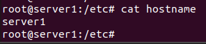  
   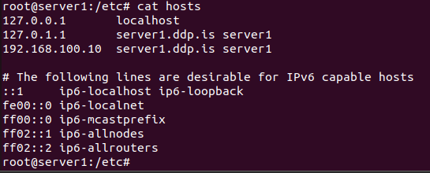  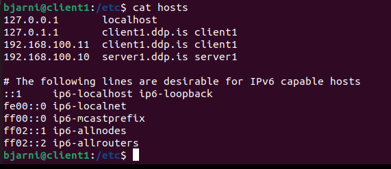

   
   
   
---
2. configure server1 with static IP Address, from the IP Address block 192.168.100.0/24. The server must be configured with the 10th usable IP Address.

  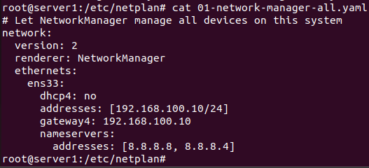
  
  
--- 
3. Install and configure DHCP on server1, so both clients get an IP Addresses, Gateway, DNS IP address and domain name automatically via HDCP.

  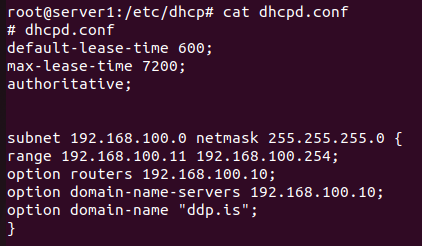  
  
---
4. Install and configure DNS server on server1, so Hostnames are resolved to IP Addresses.

  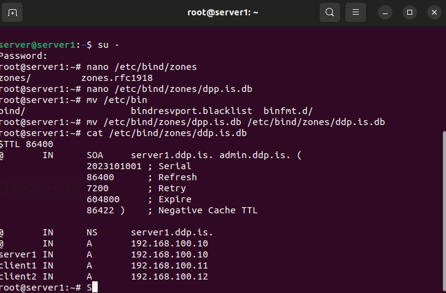 
  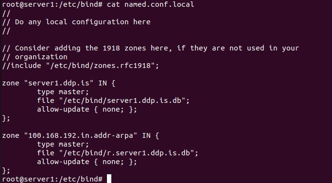
  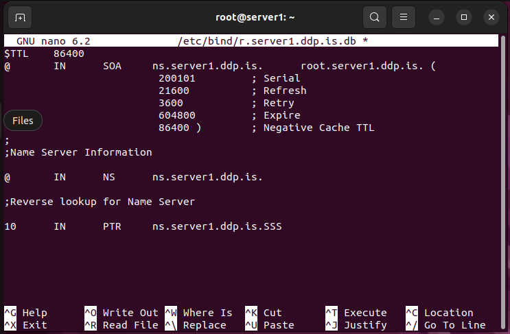
  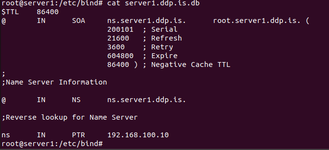
  
---
5. Create the users accounts using a script, see the Users file.

  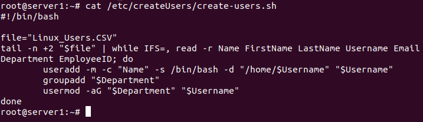
  
--- 
6. Install and configure MySQL on server1 and create Human Resource database. The
  database stores information about employees, employees are identified by their Kennitala,
  Firstname, Lastname, Email, phone Number, hire date and salary. Employees work in
  Departments where each department has one manager, departments are identified by
  department ID, department name. Each department is in a different location. Locations are
  identified by their location ID, city, Address, and zip code. One or more employees work on
  different jobs, and the jobs are identified by Job ID, job title, Min salary and max salary.

   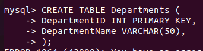
   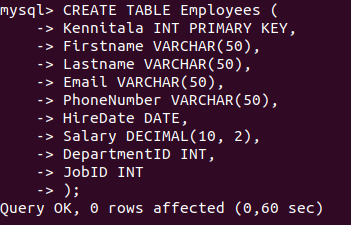
   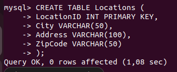
   
---
8. Due to data loss the company policy requires taking backups weekly, as system engineer you are required to schedule backups of home directories to run weekly at midnight each Friday.

   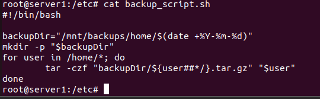
   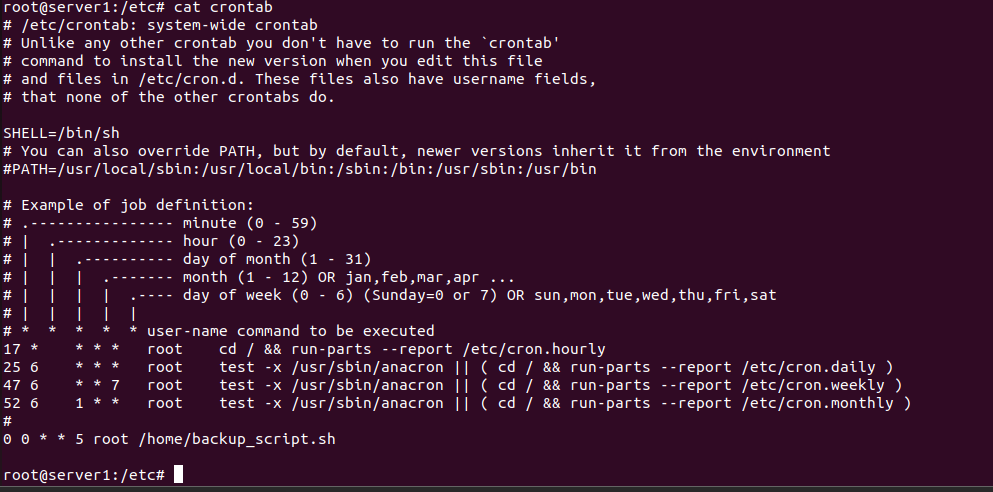
   
---
10. Install and configure NTP on the server and clients, server1 must be master server to synchronize the time of the clients.

   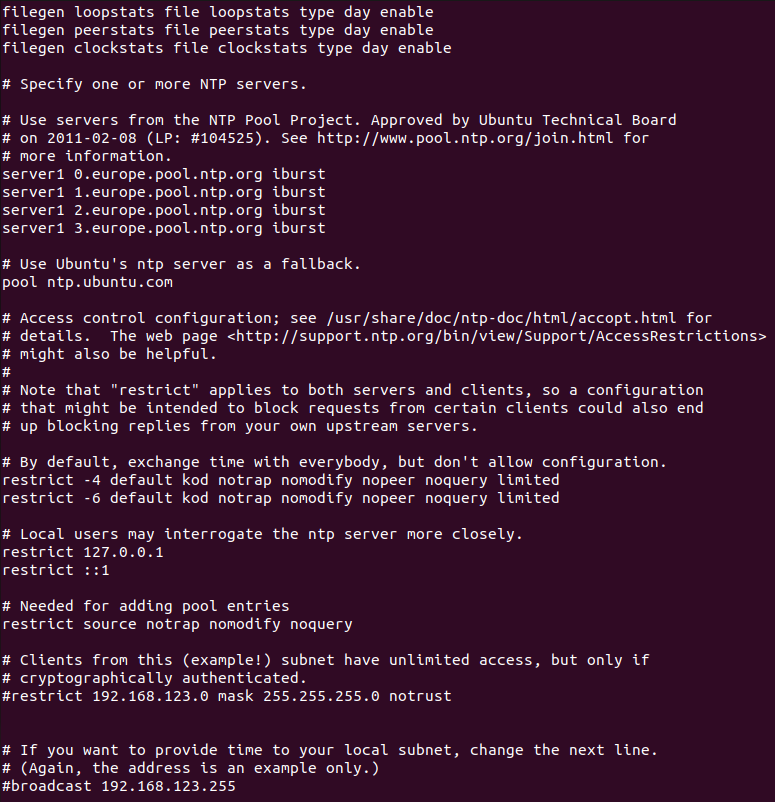
   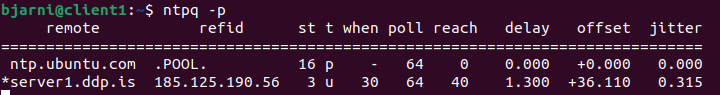

   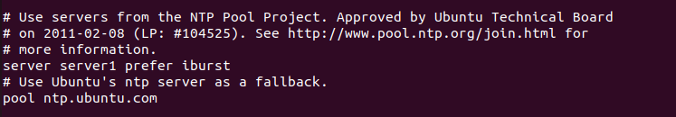
   
---
11. Install and configure syslog server on server1, server1 should get logs from both the clients for proactive management and monitoring.

   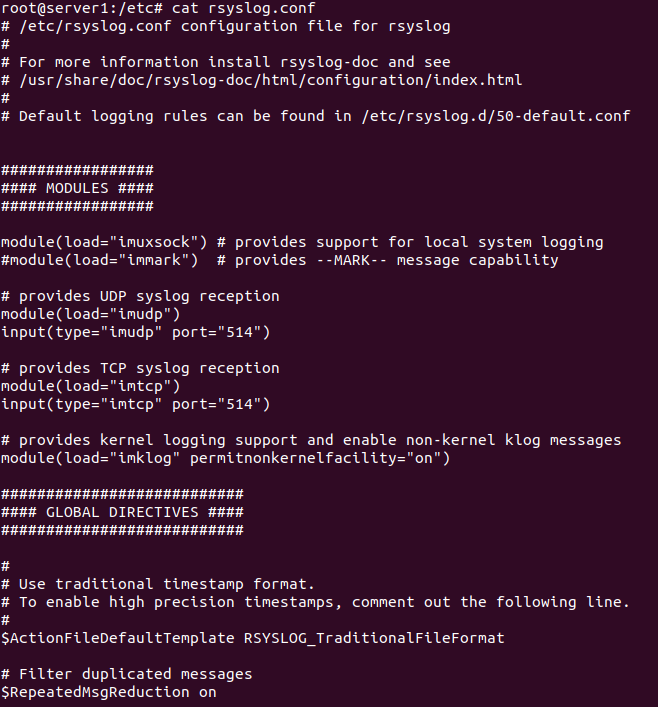
   
   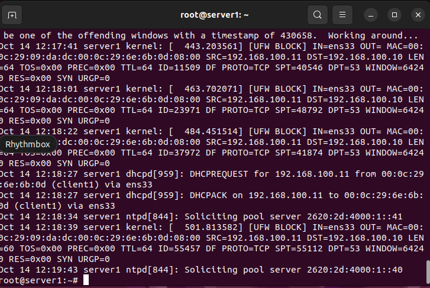

   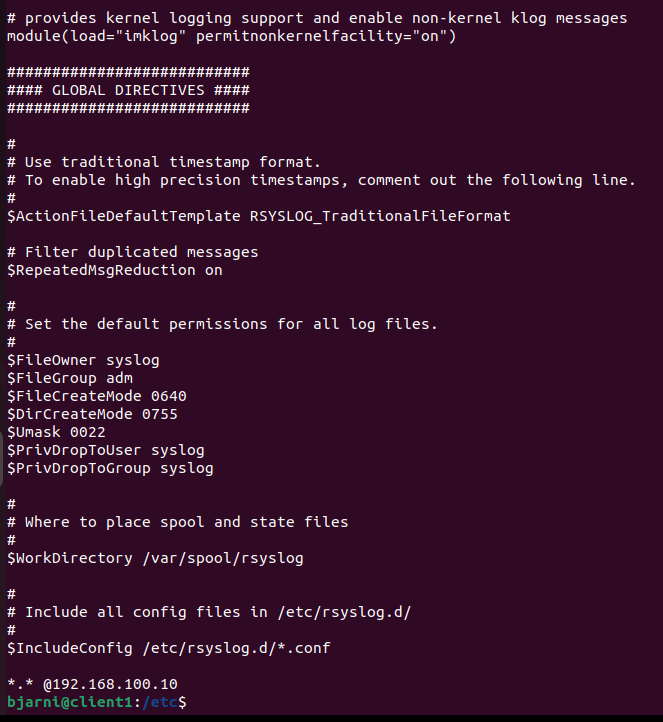
   
--- 
11. Install and configure Postfix on server1, so users can send and receive emails using Round Cube open-source software.

   Gerði ekki þetta

---
11. Install and configure shared printers for each group, only users that belong to the group should print only, accept IT and Management groups should print and manage the printers.

   Gerði ekki þetta
   
---
12. For security reasons, install and configure SSH on the server and clients, SSH login should use RSA keys instead of the password authentication.

   Gerði ekki þetta
   
---
13. All unused ports should be closed, use NMAP for testing.

   Gerði ekki þetta
   
---
